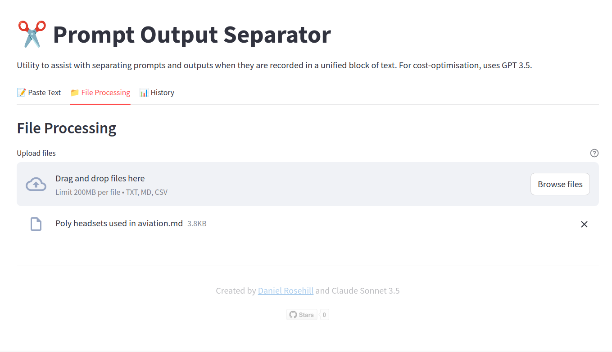

# Prompt And Output Separation Utility (V1)

This utility is designed to enable the easy separation of prompts and outputs when they are recorded together in one long continuous text block. 

The utility uses GPT 3.5 in order to send the prompt and output to the large language model and it uses the LLM both to distinguish between these two items which are sent back in a JSON response and it also suggests a title. 

The intended use case for this utility is if you have a lot of prompts and outputs recorded together in text files on your computer and you are undertaking the process of adding these to a database in which case having quickly generated titles as well as separated prompts and outputs to distinguish these and the data structure might be useful.

As with many projects, this was a collaboration between my prompting and clumsy debugging and the code generation abilities of Claude Anthropic 3.5 Sonnet.

## Screenshots (V1)

## Author

Daniel Rosehill  
(public at danielrosehill dot com)

## Licensing

This repository is licensed under CC-BY-4.0 (Attribution 4.0 International) 
[License](https://creativecommons.org/licenses/by/4.0/)

### Summary of the License
The Creative Commons Attribution 4.0 International (CC BY 4.0) license allows others to:
- **Share**: Copy and redistribute the material in any medium or format.
- **Adapt**: Remix, transform, and build upon the material for any purpose, even commercially.

The licensor cannot revoke these freedoms as long as you follow the license terms.

#### License Terms
- **Attribution**: You must give appropriate credit, provide a link to the license, and indicate if changes were made. You may do so in any reasonable manner, but not in any way that suggests the licensor endorses you or your use.
- **No additional restrictions**: You may not apply legal terms or technological measures that legally restrict others from doing anything the license permits.

For the full legal code, please visit the [Creative Commons website](https://creativecommons.org/licenses/by/4.0/legalcode).